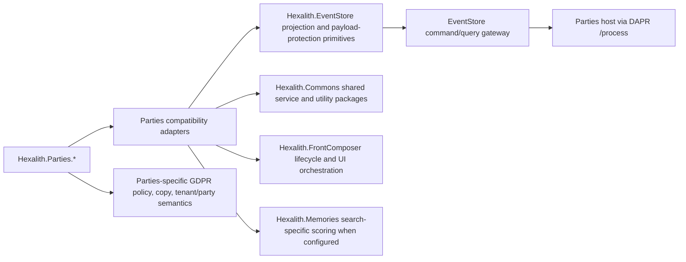

# Architecture Spine - Epic 7 Platform Alignment

## Design Paradigm

Adapter-first strangler migration over event-sourced platform boundaries.
Parties remains the behavior-preserving facade while shared platform primitives are
introduced behind compatibility adapters. Deletion of Parties-local infrastructure is
allowed only after compatibility evidence proves command, query, projection freshness,
erasure, and operational signals are unchanged or intentionally versioned.

## Inherited Invariants

| Inherited | From parent | Binds here |
| --- | --- | --- |
| EventStore gateway boundary | `_bmad-output/planning-artifacts/architecture.md` AR-D5/D7 and project context | No public Parties host API; commands and queries still enter through EventStore gateway paths. |
| Consumer self-scope and GDPR privacy | `_bmad-output/planning-artifacts/architecture.md` AR-D3 and AR-Gdpr-* | Shared platform adoption must not weaken own-data checks, erasure semantics, PII rules, or regulated copy. |
| Event-sourced projection replay | `_bmad-output/project-context.md` projection rules | At-least-once replay, duplicate tolerance, last-known fallback, and degraded freshness remain mandatory. |
| Class A shared-anchor boundary | `sprint-change-proposal-2026-06-28.md` | Epic 7 does not re-open in-repo anchors already routed to `Hexalith.Parties.Contracts` or `Hexalith.Parties.Authentication`. |
| Submodule governance | AGENTS.md and submodule project contexts | EventStore, Commons, Memories, FrontComposer, and Tenants changes require explicit story ownership, non-recursive submodule handling, and release sequencing. |

## Invariants & Rules

### AD-1 - Adapter-First Migration

- **Binds:** B1-B11, stories 7.2-7.8.
- **Prevents:** Teams deleting Parties-local infrastructure before shared primitives
  prove parity, leaving projection replay, GDPR reads, or UI freshness broken.
- **Rule:** Every implementation story introduces or consumes a Parties-compatible
  adapter first, proves old/new parity, then removes local code in a later step or
  later story.

### AD-2 - Projection Platform Ownership

- **Binds:** B1, B2, B9, stories 7.4 and 7.5.
- **Prevents:** Parties and EventStore maintaining parallel checkpoint, rebuild, and
  freshness vocabularies with incompatible sequence semantics.
- **Rule:** Projection checkpointing, rebuild orchestration, and platform freshness
  primitives are owned by `Hexalith.EventStore`; Parties owns only the compatibility
  mapping to existing `ProjectionFreshnessMetadata` and UI `StatusKind` contracts
  until a separate public-contract story changes them.

### AD-3 - Crypto Placement Gate

- **Binds:** B3, B4, B11, stories 7.6 and 7.7.
- **Prevents:** Crypto-shredding consolidation from weakening irreversible erasure,
  unreadable-payload classification, or party-specific legal policy.
- **Rule:** Generic payload-protection contracts, metadata, workflow vocabulary, and
  provider hooks live in EventStore/shared security; Parties retains party-specific
  commands, GDPR policy, copy, tenant/party key semantics, and compatibility adapters
  until the 7.6 proof harness approves migration.

### AD-4 - Utility Destination Discipline

- **Binds:** B5, B6, B7, B8, B10, B11, stories 7.2 and 7.3.
- **Prevents:** Moving helpers into arbitrary shared packages or adding new
  dependencies from contracts/UI that violate existing package boundaries.
- **Rule:** Shared utility adoption targets an existing destination when one exists:
  `Hexalith.Commons.ServiceDefaults` for service defaults, Commons diagnostics or
  metadata packages for correlation, Commons/ServiceDefaults for HTTP error shapes,
  Commons for pure paging and string helpers, Memories only for search-specific
  scoring, and FrontComposer for UI command lifecycle/orchestration.

### AD-5 - Release Sequencing Before References

- **Binds:** B1-B11, stories 7.1 and 7.8.
- **Prevents:** Parties referencing APIs that are only present in a local submodule
  checkout, causing fresh-clone or CI failures.
- **Rule:** If a needed shared API is missing, land it additively in the owning
  submodule first, validate that submodule's gates, update the root submodule pointer
  or package reference through Central Package Management, then adopt it in Parties.

### AD-6 - Compatibility And Rollback Gates

- **Binds:** B1-B11, stories 7.2-7.8.
- **Prevents:** Platform adoption becoming an irreversible operational migration with
  no path back when projections, key access, or shared packages regress.
- **Rule:** Each story has a named rollback: adapter switch, package/submodule pointer
  rollback, dual-read comparison, or deferred deletion. Rollback must preserve data,
  projection state, EventStore gateway routes, and PII redaction.

## Consistency Conventions

| Concern | Convention |
| --- | --- |
| Story sequencing | Inventory and ADR first; low-risk utility adoption second; projection adapters third; crypto/key-management last; release cleanup last. |
| Package references | Prefer project references to root-declared `references/` submodules already used by the repository; add `HexalithCommonsRoot` only through an owned story. |
| Public contracts | Additive only. Removing or renaming contract fields, enum values, command/query shapes, or metadata is outside Epic 7 unless a separate breaking-change plan approves it. |
| Testing | Parity tests must cover old/new code paths, duplicate/out-of-order replay, stale/degraded freshness, key-unavailable reads, erased party behavior, and rollback. |
| Logs and telemetry | Low-cardinality and PII-free. No event payloads, party names, identifiers, raw key aliases, destroyed-key details, or decrypted values. |
| Rollback | Every implementation story names the exact switch, pointer, or code path that restores prior behavior. |

## Stack

| Name | Version |
| --- | --- |
| .NET SDK | 10.0.302 in Parties project context |
| Target framework | net10.0 |
| Dapr packages | 1.18.4 in Parties |
| Aspire packages | 13.4.6 in Parties |
| FluentUI Blazor | 5.0.0-rc.3-26138.1 in Parties |
| ModelContextProtocol | 1.4.0 in Parties |
| Hexalith.EventStore | root project reference under `references/Hexalith.EventStore` |
| Hexalith.FrontComposer | root project reference under `references/Hexalith.FrontComposer` |
| Hexalith.Memories | optional root project reference under `references/Hexalith.Memories` |
| Hexalith.Commons | root submodule present under `references/Hexalith.Commons`; not yet referenced by Parties |

## Structural Seed



```text
_bmad-output/planning-artifacts/
  epic-7-implementation-plan-2026-06-29.md
  architecture/epic-7-platform-alignment-2026-06-29/
    ARCHITECTURE-SPINE.md
    .memlog.md

src/Hexalith.Parties.*
  Adapters/ or Services/    # story-owned compatibility adapters before deletion

references/Hexalith.EventStore/
  src/Hexalith.EventStore.Contracts/Security/
  src/Hexalith.EventStore.Server/Projections/

references/Hexalith.Commons/
  src/libraries/Hexalith.Commons.ServiceDefaults/
  src/libraries/Hexalith.Commons*/

references/Hexalith.FrontComposer/
  src/Hexalith.FrontComposer.Shell/Services/Lifecycle/
```

## Capability -> Architecture Map

| Capability / Area | Lives in | Governed by |
| --- | --- | --- |
| B1 projection checkpoint and replay dedupe | EventStore projection primitives plus Parties adapter | AD-1, AD-2, AD-6 |
| B2 resumable projection rebuild | EventStore rebuild orchestrator/checkpoint store plus Parties adapter | AD-1, AD-2, AD-6 |
| B3/B4 crypto-shredding and key management | EventStore/shared security for generic provider contracts; Parties for party policy | AD-1, AD-3, AD-6 |
| B5 ServiceDefaults | Commons ServiceDefaults, with a thin Parties wrapper if needed | AD-4, AD-5 |
| B6 correlation | Commons metadata/diagnostics or additive Commons middleware | AD-4, AD-5 |
| B7 ProblemDetails | Commons/ServiceDefaults shared error mapping when available or additive story | AD-4, AD-5 |
| B8 search normalization/similarity | Commons for pure text helpers; Memories for search-specific scoring | AD-4, AD-5 |
| B9 freshness vocabulary | EventStore ETag/query metadata mapped to Parties `ProjectionFreshnessMetadata` | AD-2, AD-6 |
| B10 paging | Commons generic paging result plus Parties compatibility adapter | AD-4, AD-6 |
| B11 mixed primitives | Split by owner: EventStore, Commons, FrontComposer, or Parties policy | AD-3, AD-4 |

## Deferred

- Exact public API additions in EventStore, Commons, Memories, or FrontComposer are
  deferred to story 7.1 inventory and the owning submodule stories because the plan
  must not assert package surfaces that do not exist yet.
- Deleting Parties-local projection, crypto, paging, search, or service-defaults code
  is deferred until the relevant adapter story proves old/new parity and rollback.
- Any breaking package release, public contract rename, or external consumer migration
  is outside Epic 7 unless a separate release plan approves the break.
